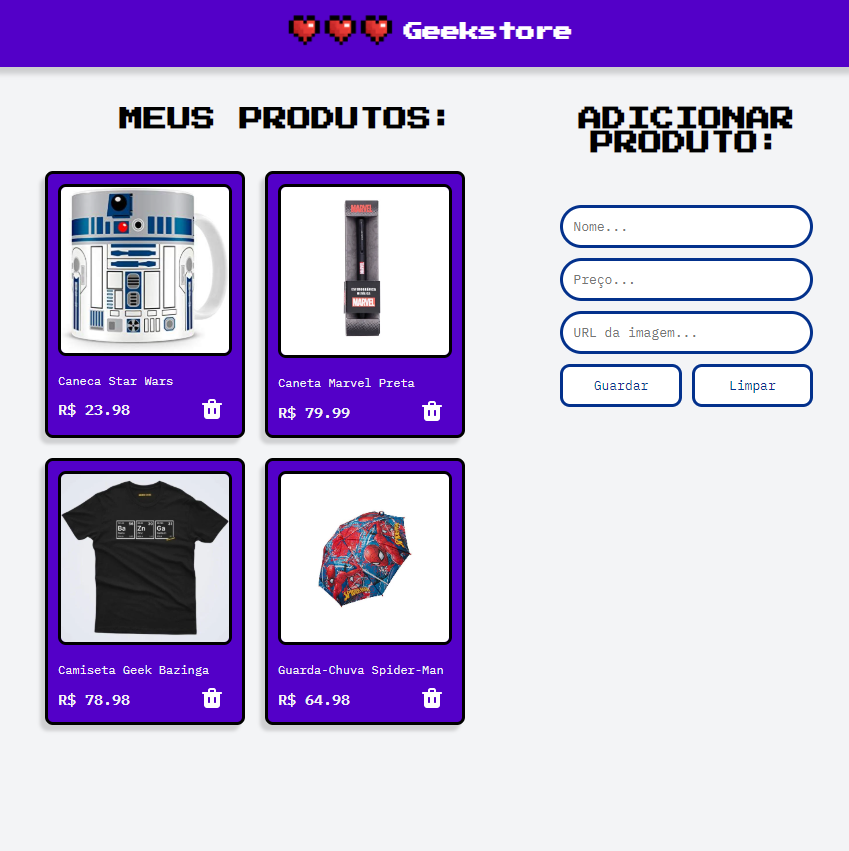

  

## 🖥️ Projeto

O projeto é um estudo de JavaScript para implementação de APIs utilizando o json-server para simular os recursos principais de uma loja on-line.

## Utilização

- rode o comando `json-server --watch db.json` no terminal para rodar o json-server e visualizar os arquivos contidos no banco de dados simulados em formato json. 

## 🚀 Tecnologias

Esse projeto foi desenvolvido com as seguintes tecnologias:

- HTML
- CSS
- JAVASCRIPT
- GIT e GITHUB

